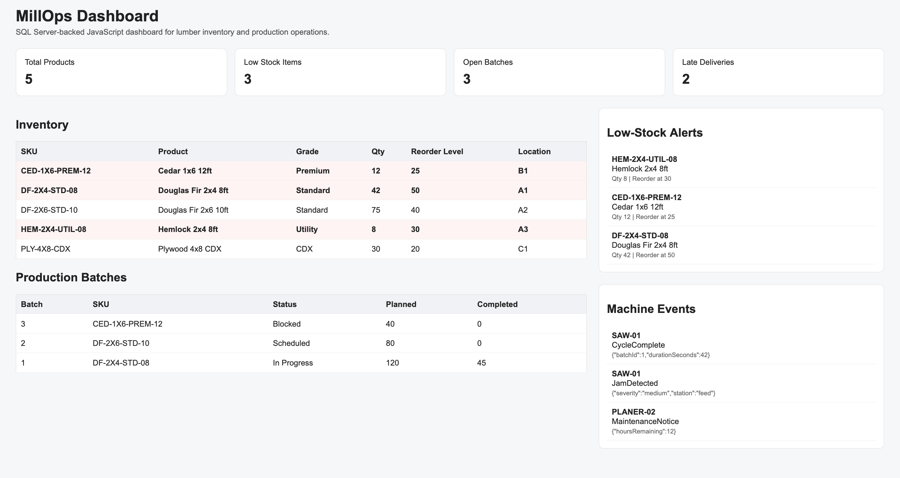

# MillOps Dashboard

A Microsoft SQL Server-backed JavaScript dashboard for tracking pallet cutstock inventory, lumber supply, production batches, supplier deliveries, machine events, and low-stock alerts.



## Why this project exists

This project demonstrates practical JavaScript, SQL Server, T-SQL, REST API, and dashboard development for operational business systems.

The application mirrors a real internal workflow: monitor inventory, identify low-stock items, track production batches, surface late deliveries, and inspect machine event logs.

## Tech Stack

- JavaScript
- Node.js
- Express
- Microsoft SQL Server
- T-SQL
- RESTful JSON APIs
- HTML/CSS
- Docker
- Git/GitHub

## Features

- SQL Server schema with primary keys, foreign keys, constraints, and indexes
- Inventory dashboard summary cards
- Inventory table with low-stock highlighting
- REST APIs returning JSON
- Low-stock alert endpoint
- Production batch tracking
- Supplier delivery status tracking
- Machine event log display
- Dockerized local SQL Server setup

## Database Design

The database uses normalized tables for:

- Suppliers
- Lumber products
- Inventory
- Production batches
- Supplier deliveries
- Machine events

The schema includes:

- Primary keys
- Foreign keys
- CHECK constraints
- Indexes
- SQL Server `DATETIME2`
- SQL Server `IDENTITY`
- T-SQL queries for operational reporting

## API Endpoints

| Method | Endpoint | Purpose |
|---|---|---|
| GET | `/api/health` | Checks API and SQL Server connectivity |
| GET | `/api/dashboard/summary` | Returns dashboard metrics |
| GET | `/api/inventory` | Returns inventory records |
| PUT | `/api/inventory/:id` | Updates an inventory record |
| GET | `/api/alerts/low-stock` | Returns low-stock items |
| GET | `/api/production/batches` | Returns production batch records |
| GET | `/api/supplier-deliveries` | Returns supplier delivery records |
| GET | `/api/machine-events` | Returns machine event logs |

## Example SQL Query

```sql
SELECT
    p.sku,
    p.product_type,
    p.grade,
    i.quantity_on_hand,
    i.reorder_level,
    i.location_code
FROM Inventory i
JOIN LumberProducts p
    ON i.product_id = p.product_id
WHERE i.quantity_on_hand <= i.reorder_level
ORDER BY i.quantity_on_hand ASC;
```

## Local Setup

### 1. Clone the repository

```bash
git clone https://github.com/ma-dev-usa/millops-dashboard.git
cd millops-dashboard
```

### 2. Install dependencies

```bash
npm install
```

### 3. Start SQL Server

```bash
docker compose up -d
```

### 4. Load the SQL Server schema and seed data

```bash
docker exec -i millops-sql /opt/mssql-tools18/bin/sqlcmd \
  -S localhost \
  -U sa \
  -P 'MillOps!2026Dev' \
  -C < db/schema.sql
```

### 5. Start the application

```bash
npm run dev
```

Open the dashboard:

```txt
http://localhost:3000
```

## API Smoke Test

```bash
curl http://localhost:3000/api/health
curl http://localhost:3000/api/dashboard/summary
curl http://localhost:3000/api/inventory
curl http://localhost:3000/api/alerts/low-stock
```

Expected health response:

```json
{"status":"ok","database":1}
```

## Resume Summary

Built a Microsoft SQL Server-backed JavaScript dashboard for lumber inventory, supplier deliveries, production batches, machine events, and low-stock alerts using Node.js, Express, T-SQL, and RESTful JSON APIs.
